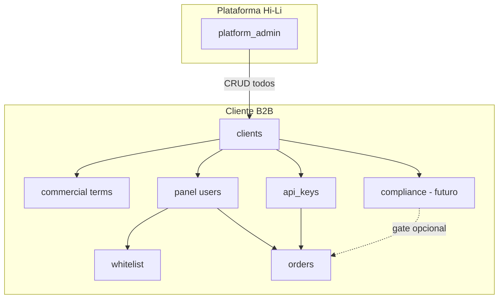

# Clients Architecture (Multi-Tenant B2B)

## Objetivo

Definir a arquitetura da camada **clientes** (`clients`) como entidade raiz do painel B2B,
subordinando:

- cadastro de **usuários** do painel;
- **políticas comerciais** (spread, limites);
- isolamento de **dados operacionais** (ordens, whitelist, API keys, observabilidade);
- futuro processo de **KYB/KYC** e gates de compliance.

Este documento é o contrato de implementação **antes** do código (Fase A).
Após validação do time, a execução segue as fases 3.0–3.4 descritas abaixo.

## Contexto atual (baseline)

Hoje o MVP trata cada **operador** como integrador implícito:

| Recurso | Escopo atual |
|---------|----------------|
| `panel_access_list` | Usuários globais; papéis `admin`, `operator`, `viewer` |
| Termos comerciais | `spread_bps_override`, `max_amount_brl` no **operador** (Package 2.5) |
| `api_keys` | `linked_user_id` → operador Supabase Auth |
| Ordens on/off-ramp | `created_by_user_id` + `integrator_external_id` único por operador |
| Whitelist wallets/PIX | `user_id` por operador |
| Admin Hi-Li | `role = admin` vê tudo (único tenant implícito) |

**Problema:** não há isolamento entre integradores B2B distintos nem lugar único para política
comercial e compliance do **cliente jurídico** (CNPJ).

## Princípios de desenho

1. **Cliente** = pessoa jurídica integradora B2B (CNPJ), não usuário individual.
2. Todo usuário de painel (exceto admin de plataforma) pertence a **exatamente um** cliente.
3. Política comercial vive no **cliente**; usuários e API keys **herdam** do cliente.
4. Isolamento de dados é por `client_id` em todas as entidades operacionais.
5. Admin de plataforma (Hi-Li) é **cross-tenant**; demais papéis são **single-tenant**.
6. KYB/KYC é modelo separado, acoplado ao cliente, introduzido sem bloquear Fases 3.0–3.2.
7. Migração **incremental**: cliente Legacy absorve dados existentes; zero downtime alvo.
8. Writes sensíveis continuam via **service-role** (server actions / API v1), como hoje.

## Hierarquia de domínio

```text
Platform (Hi-Li)
└── Client (B2B integrator, CNPJ)
    ├── Commercial profile (spread, max BRL)
    ├── Compliance profile (KYB/KYC — futuro)
    ├── Panel users (operator, viewer, client_admin)
    ├── API keys
    ├── Whitelist (wallets USDC, chaves PIX)
    └── Orders (on-ramp, off-ramp)
```



## Modelo de dados

### Tabela `clients`

Entidade raiz do tenant B2B.

```sql
create table public.clients (
  id uuid primary key default gen_random_uuid(),

  -- Identificação
  legal_name text not null,
  trade_name text,
  tax_id text not null,                    -- CNPJ normalizado (somente dígitos)
  contact_email text,

  -- Ciclo de vida operacional
  status text not null default 'draft'
    check (status in ('draft', 'active', 'suspended', 'archived')),

  -- Política comercial (herdada por usuários e API keys do cliente)
  spread_bps_override int
    check (spread_bps_override is null or (spread_bps_override >= 0 and spread_bps_override <= 10000)),
  max_amount_brl text,

  metadata jsonb,
  created_by_email text,
  created_at timestamptz not null default now(),
  updated_at timestamptz not null default now(),

  constraint clients_tax_id_unique unique (tax_id)
);

create index clients_status_idx on public.clients (status, created_at desc);
```

| Campo | Regra |
|-------|--------|
| `status = draft` | Pode ter usuários; **não** opera ramp (configurável) |
| `status = active` | Operação normal (sujeito a KYB quando existir) |
| `status = suspended` | Bloqueio administrativo imediato |
| `status = archived` | Somente leitura histórica |
| `tax_id` | Único; normalizado para dígitos no servidor |
| `spread_bps_override` | `null` → usa `ONRAMP_QUOTE_SPREAD_BPS` / env |
| `max_amount_brl` | `null` → sem limite por operação além de env global |

### Alteração `panel_access_list`

```sql
alter table public.panel_access_list
  add column client_id uuid references public.clients (id) on delete restrict;

-- Após backfill: operadores/viewers exigem client_id; admin plataforma fica null.
-- spread_bps_override e max_amount_brl serão REMOVIDOS após migração para clients (Fase 3.1).
```

| Papel | `client_id` | Escopo |
|-------|-------------|--------|
| `admin` (plataforma) | `null` | Todos os clientes |
| `client_admin` (novo, Fase 3.3) | obrigatório | Próprio cliente |
| `operator` | obrigatório | Ramp + API + whitelist do cliente |
| `viewer` | obrigatório | Leitura no cliente |

**Decisão MVP:** manter valor `admin` existente como admin de plataforma; introduzir
`client_admin` na Fase 3.3. Não renomear `admin` → `platform_admin` no banco na v1
(evita migração de código ampla); documentar alias semântico.

### Tabela `client_compliance_profiles` (Fase 3.4 — schema reservado)

Não implementar na Fase 3.0; schema alvo para planejamento KYB/KYC:

```sql
create table public.client_compliance_profiles (
  client_id uuid primary key references public.clients (id) on delete cascade,

  kyb_status text not null default 'not_started'
    check (kyb_status in ('not_started', 'pending', 'approved', 'rejected')),
  kyc_status text not null default 'not_started'
    check (kyc_status in ('not_started', 'pending', 'approved', 'rejected', 'not_applicable')),

  submitted_at timestamptz,
  reviewed_at timestamptz,
  reviewed_by_email text,
  rejection_reason text,
  notes text,
  metadata jsonb,

  created_at timestamptz not null default now(),
  updated_at timestamptz not null default now()
);
```

**Gate de negócio (futuro):** `quote`/`lock` exigem `clients.status = active` e,
se `CLIENT_KYB_REQUIRED=true`, `kyb_status = approved`.

### Colunas `client_id` em entidades operacionais

Adicionar em fases; todas nullable durante migração, depois `NOT NULL` onde aplicável.

| Tabela | Fase | Notas |
|--------|------|-------|
| `panel_access_list` | 3.0 | FK para cliente |
| `api_keys` | 3.2 | Denormalizado; deve bater com cliente do `linked_user_id` |
| `onramp_orders` | 3.2 | Backfill via `created_by_user_id` |
| `offramp_orders` | 3.2 | Idem |
| `user_withdraw_whitelist` | 3.2 | Backfill via `user_id` |
| `user_pix_whitelist` | 3.2 | Idem |
| `api_key_request_logs` | 3.2 | Via `api_key_id` ou denormalizado |

**Índice `integrator_external_id` (evolução):**

Hoje: único por `(created_by_user_id, integrator_external_id)`.

Alvo: único por `(client_id, integrator_external_id)` — alinha referência do integrador
ao tenant, não ao usuário que clicou no painel.

```sql
-- Substituição planejada (Fase 3.2)
create unique index onramp_orders_client_external_id_key
  on public.onramp_orders (client_id, integrator_external_id)
  where client_id is not null and integrator_external_id is not null;
```

## Resolução de termos comerciais (evolução do Package 2.5)

Função alvo `resolveCommercialTerms()`:

```text
1. spread_bps_override do clients (se operator/client scoped)
2. legado: spread no operador (só durante migração)
3. legado: spread na api_keys (só durante migração)
4. ONRAMP_QUOTE_SPREAD_BPS / OFFRAMP_QUOTE_SPREAD_BPS (env)
```

```text
max_amount_brl:
1. clients.max_amount_brl
2. legado operador / api_key
3. sem limite (ou admin_test_settings global para sandbox)
```

Admin de plataforma sem `client_id` continua usando **apenas env** (comportamento atual).

Arquivos a evoluir:

- `src/lib/commercial/resolve.ts`
- `src/lib/commercial/operator-profile.ts` → `client-profile.ts`
- `src/lib/commercial/api-key.ts`, `panel.ts`

## Autenticação e contexto de request

### Painel (Bearer Supabase)

Estender `PanelAccessContext`:

```typescript
type PanelAccessContext = {
  admin: SupabaseAdminClient;
  userId: string;
  email: string;
  role: PanelUserRole;
  clientId: string | null;       // null = platform admin
  clientStatus?: ClientStatus;   // quando clientId presente
};
```

`requirePanelRoleFromAccessToken` passa a carregar `client_id` (join `panel_access_list`).

**Regras:**

- Operador/viewer sem `client_id` → erro de configuração (pós-migração).
- `client.status !== active` → bloquear quote/lock (exceto platform admin).
- Platform admin pode opcionalmente **impersonar filtro** por `?clientId=` em listagens.

### API v1 (Bearer API secret)

Estender `ApiKeyAuthContext`:

```typescript
type ApiKeyAuthContext = {
  apiKeyId: string;
  clientId: string;
  userId: string;
  email: string | null;
  scopes: ApiKeyScope[];
  // spreadBpsOverride / maxAmountBrl removidos após Fase 3.1
};
```

Toda rota `/api/v1/*` deve:

1. Autenticar key;
2. Resolver `client_id` da key;
3. Filtrar leituras/escritas por `client_id`;
4. Resolver termos comerciais do **cliente**.

## Isolamento e autorização

### Server-side (service-role) — padrão atual

Mantém-se: RLS restritiva + lógica no servidor. Novas queries **sempre** incluem
`client_id` quando o ator não é platform admin.

### RLS (evolução gradual)

Fase 3.0: RLS em `clients` — somente `is_panel_admin()` lê/escreve.

Fase 3.2+: políticas por tabela operacional (exemplo ordens):

```sql
-- Platform admin
using (public.is_panel_admin())

-- Usuário do mesmo cliente (leitura)
using (
  client_id = (
    select p.client_id from public.panel_access_list p
    where lower(p.email) = lower(auth.jwt() ->> 'email')
      and p.is_active = true
  )
)
```

Funções auxiliares sugeridas:

```sql
create function public.current_panel_client_id() returns uuid ...
create function public.is_platform_admin() returns boolean ...
-- is_panel_admin() permanece como alias do admin de plataforma
```

## UI do painel (mapa de telas)

| Rota | Papel | Fase |
|------|-------|------|
| `/app/clients` | platform admin | 3.0 |
| `/app/clients/:id` | platform admin | 3.0 — detalhe + comercial |
| `/app/users` | platform admin | 3.0 — adicionar filtro/seleção de cliente |
| `/app/users` | client_admin | 3.3 — só usuários do próprio cliente |
| Demais telas operador | operator | 3.2 — dados filtrados por cliente |

**Sidebar:** item **Clientes** na seção de gestão (platform admin), abaixo do divisor
junto com Usuários, Whitelist, etc.

## Contratos de server actions (painel)

### `clients.ts` (novo)

```typescript
listClientsAction(accessToken): ClientRow[]
getClientAction(accessToken, clientId): ClientRow
createClientAction(accessToken, input: ClientInput): ClientRow
updateClientAction(accessToken, clientId, input: ClientUpdateInput): ClientRow
// archiveClientAction — soft via status = archived
```

`ClientInput` mínimo:

```typescript
type ClientInput = {
  legalName: string;
  tradeName?: string;
  taxId: string;
  contactEmail?: string;
  status?: 'draft' | 'active';
  spreadBpsOverride?: string;
  maxAmountBrl?: string;
};
```

Autorização: `requireAdminFromAccessToken` (platform admin only) nas Fases 3.0–3.1.

### Evolução `user-management.ts`

```typescript
createPanelUserAction(accessToken, {
  ...
  clientId: string;  // obrigatório para operator/viewer/client_admin
})
```

Platform admin seleciona cliente no formulário. Client admin (Fase 3.3): `clientId` fixo
do contexto, não editável.

## Contratos API v1 (sem breaking change de paths)

Paths permanecem `/api/v1/...`. Mudança **interna**: escopo por `client_id`.

| Endpoint | Mudança |
|----------|---------|
| `POST .../quote` | Termos do cliente; valida `client.status` |
| `POST .../lock` | Whitelist e ordem no escopo do cliente |
| `GET .../orders` | Lista somente ordens do `client_id` da key |
| `GET .../orders/:id` | 404 se ordem de outro cliente |
| `externalId` | Unicidade por `(client_id, externalId)` |

Respostas públicas **não** expõem `clientId` na v1 inicial (opcional campo futuro).

## Migração de dados

### Cliente bootstrap `Legacy`

```sql
insert into public.clients (
  id, legal_name, trade_name, tax_id, status, contact_email, created_by_email
) values (
  '00000000-0000-4000-8000-000000000001',  -- UUID fixo documentado
  'Legacy Integrators',
  'Legacy',
  '00000000000000',
  'active',
  null,
  'migration@hili.internal'
);
```

### Backfill (ordem)

1. Criar `clients` + Legacy.
2. `UPDATE panel_access_list SET client_id = <legacy> WHERE role IN ('operator','viewer')`.
3. Fase 3.1: copiar `spread_bps_override`, `max_amount_brl` do operador para o cliente
   (um cliente por operador **ou** consolidar operadores no Legacy — ver decisão abaixo).
4. Fase 3.2: `UPDATE api_keys SET client_id = ... FROM panel_access_list ...`.
5. Fase 3.2: ordens e whitelist via join em `created_by_user_id` / `user_id`.
6. Validar contagens; `ALTER COLUMN client_id SET NOT NULL` onde aplicável.
7. Fase 3.1+: dropar colunas comerciais de `panel_access_list` e `api_keys`.

### Script de verificação (smoke pós-migração)

- Operador Legacy continua quote/lock.
- Segundo cliente de teste não vê ordens do primeiro.
- API key do cliente A não lê ordem do cliente B (404).

## Fases de implementação

### Fase 3.0 — Fundação

| Entrega | Detalhe |
|---------|---------|
| Migration `clients` + `panel_access_list.client_id` | |
| Cliente Legacy + backfill operadores | |
| CRUD admin `/app/clients` | |
| Listagem usuários com coluna cliente | |
| **Sem** mudança em ramp/API ainda | Comportamento idêntico |

**Critério de aceite:** platform admin gerencia clientes; operadores existentes intactos.

### Fase 3.1 — Política comercial no cliente

| Entrega | Detalhe |
|---------|---------|
| Termos em `clients` | UI no detalhe do cliente |
| `resolveCommercialTerms` por `clientId` | Painel + API v1 |
| Remover UI comercial de usuário | Mover para cliente |
| Deprecar colunas no operador | Manter leitura legado temporária |

**Critério de aceite:** dois clientes com spreads distintos → quotes distintas.

### Fase 3.2 — Isolamento de dados

| Entrega | Detalhe |
|---------|---------|
| `client_id` em keys, ordens, whitelist, logs | |
| Filtros em todas as listagens | |
| Índice `externalId` por cliente | |
| Testes de não-vazamento | |

**Critério de aceite:** smoke multi-cliente passa.

### Fase 3.3 — Gestão delegada

| Entrega | Detalhe |
|---------|---------|
| Papel `client_admin` | |
| CRUD usuários no próprio cliente | |
| Política whitelist: client_admin aprova? | Decisão produto |

### Fase 3.4 — KYB/KYC

| Entrega | Detalhe |
|---------|---------|
| `client_compliance_profiles` | |
| UI status compliance | |
| Gate opcional em quote | Env `CLIENT_KYB_REQUIRED` |
| Upload documentos | Fase 3.5+ |

## Decisões abertas (validação do time)

Preencher antes de iniciar Fase 3.0:

| # | Pergunta | Recomendação MVP |
|---|----------|------------------|
| D1 | Um operador pode pertencer a vários clientes? | **Não** |
| D2 | No Legacy, um cliente ou um cliente por operador existente? | **Um Legacy** para todos; novos clientes separados |
| D3 | `client_admin` na 3.0 ou só na 3.3? | **Só 3.3** |
| D4 | Quem aprova whitelist pós multi-tenant? | Platform admin + client_admin |
| D5 | CNPJ `00000000000000` aceito para Legacy/sandbox? | **Sim**, documentado |
| D6 | Bloquear `draft` em quote? | **Sim** para operadores; admin pode testar |
| D7 | Expor `clientId` na API v1 pública? | **Não** na primeira versão |

## Riscos e mitigações

| Risco | Mitigação |
|-------|-----------|
| Queries sem filtro `client_id` | Checklist PR + teste integração 2 clientes |
| Backfill incompleto | Scripts SQL idempotentes + relatório de órfãos |
| Breaking API para integradores | Escopo interno; paths inalterados |
| Complexidade RLS | Fase 3.2 incremental; service-role como source of truth |
| KYB prematuro | Schema reservado; gate desligado por default |

## Relação com roadmap existente

| Item roadmap | Ordem sugerida |
|--------------|----------------|
| Smoke E2E piloto (single tenant) | Antes ou em paralelo com 3.0 |
| Fase 3.0 + 3.1 | **Próximo após validação deste doc** |
| Webhooks outbound | Paralelo a 3.2 |
| Fase 3.2 | Quando houver 2º cliente real |
| KYB/KYC | Fase 3.4+ |

## Referências no repositório

| Arquivo | Conteúdo relacionado |
|---------|---------------------|
| `src/lib/commercial/` | Resolver de termos (evoluir para cliente) |
| `src/lib/users/require-panel-role.ts` | Contexto de auth do painel |
| `src/lib/api-keys/store.ts` | Auth API v1 |
| `supabase/migrations/20260612120000_operator_commercial_profile.sql` | Baseline comercial atual |
| `supabase/migrations/20260610120000_integrator_external_id.sql` | External ID por operador |
| `README.md` | Roadmap multi-tenant |

## Checklist de validação deste plano

- [ ] D1–D7 acordadas pelo time
- [ ] Fase 3.0 aceita como primeiro incremento de código
- [ ] Cliente Legacy e UUID fixo aprovados
- [ ] Política comercial no cliente (não no usuário) aprovada
- [ ] KYB/KYC fora do escopo imediato, schema reservado OK
- [ ] Ordem: 3.0 → 3.1 → (smoke multi) → 3.2 confirmada

---

**Status:** Fase 3.0 em implementação — ver migration `20260613120000_clients.sql`.
