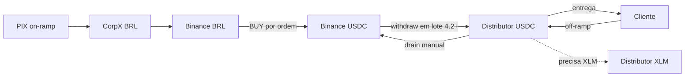

# Treasury Architecture (Capital Proprietário)

## Objetivo

Definir a arquitetura do módulo de **tesouraria** do painel Hi-Li: visibilidade e
gestão do capital próprio que sustenta on/off-ramp (CorpX, Binance, Stellar
`usdc-distributor`), com rebalanceamento manual e, depois, automático — **fora**
do caminho crítico do usuário.

Este documento é o contrato de implementação. A execução segue as fases 4.0–4.4.

## Contexto atual (baseline)

| Bolso | Papel | Estado no código |
|-------|--------|------------------|
| CorpX (BRL) | Recebe/envia PIX | `queryBalance` no adapter; sem painel |
| Binance (BRL + USDC) | Trades e saque cripto | Módulo + rotas admin; sem UI de tesouraria |
| Stellar `usdc-distributor` (USDC + XLM) | Float on-chain + gas | Env `ONRAMP_USDC_DISTRIBUTOR_*`; sem Horizon |
| BRH | Posição regulatória | Card no dashboard |

Hoje a **reconciliação on-ramp** é por ordem (`reconciliation.ts`): BUY Binance →
BRH redeem → **withdraw Binance → distributor**. O saque (~1 USDC) é efetivamente
repassado por operação via `ONRAMP_USDC_DELIVERY_FEE_USDC`.

`BINANCE_MVP_PLAN.md` deixa bandas de float / loop de tesouraria fora do MVP.

## Princípios de desenho

1. Leituras e ações de tesouraria **nunca** no caminho síncrono do usuário.
2. Acesso exclusivo a `platform_admin` (`role = admin`).
3. Falha parcial por bolso: overview degrada com `ok: false` + `error`, sem 500 global.
4. Separar **reconciliação econômica** (BUY + BRH por ordem) de **refill físico**
   (withdraw em lote) — a partir da Fase 4.2.
5. Automação só depois de refill manual validado em produção.
6. Feature flags para rollback (ex.: `TREASURY_BATCH_REFILL_ENABLED`).
7. Recarga de **XLM** no distributor: visibilidade + alerta na v1; top-up manual.

## Hierarquia de domínio

```text
Platform (Hi-Li)
└── Treasury (capital proprietário)
    ├── CorpX BRL
    ├── Binance BRL / USDC
    ├── Stellar distributor USDC / XLM
    ├── BRH (informativo)
    ├── Policies (Fase 4.2+)
    └── Runs / refill batches (Fase 4.1+)
```



## Modelo de dados (fases posteriores)

### `treasury_policies` (4.2+)

Configuração por bolso: `min_balance`, `target_balance`, `max_balance`,
`auto_enabled`, `cooldown_minutes`, `refill_volume_threshold` (distributor USDC).

### `treasury_runs` / `treasury_refill_batches` (4.1+)

Auditoria de execuções: `trigger` (`manual` \| `scheduled` \| `threshold`),
`status`, `dry_run`, `steps`, `error`, vínculo com withdraw Binance e ordens.

Fase 4.0 **não** cria tabelas — só agrega leituras existentes.

## Autenticação

- UI: `/app/treasury` — redirect se `profile.role !== 'admin'`.
- API: `Authorization: Bearer <access_token>` + `requireAdminFromAccessToken`
  (mesmo padrão de `/api/binance/*`).

## UI mapa

| Rota | Papel | Conteúdo |
|------|--------|----------|
| `/app/treasury` | admin | Aba **Bolsos**: overview + runs manuais. Aba **Configurações**: placeholder das políticas automáticas (ainda não persiste nem dispara). |

Nav: `managementNavItems` em `AppShell` (bloco admin).

## Contratos API

### `GET /api/treasury/overview` (Fase 4.0)

Resposta (resumo):

- `generatedAt`
- `pockets.corpx` — available / reserved / total BRL
- `pockets.binance` — free/locked BRL e USDC
- `pockets.distributor` — endereço (completo server-side), rede, USDC, XLM, Horizon URL
- `pockets.brh` — saldo singleton
- `pendingRefills` — ordens em `usdc_delivered` \| `needs_review` \| `fx_settled` \| `brh_redeemed`

Cada pocket: `{ ok: true, ... } | { ok: false, error: string }`.

## Fases de implementação

### Fase 4.0 — Visibilidade (read-only)

| Entrega | Detalhe |
|---------|---------|
| Doc | Este arquivo |
| Horizon | Client leve (fetch) para saldos XLM + USDC do distributor |
| API | `GET /api/treasury/overview` |
| UI | `/app/treasury` + nav + i18n |

**Critério de aceite:** admin vê 4 cards (CorpX, Binance BRL+USDC, distributor
USDC+XLM, BRH) e a fila de refills; zero movimento de capital.

### Fase 4.1 — Refill manual em lote

| Entrega | Detalhe |
|---------|---------|
| Schema | `treasury_runs` (auditoria) |
| API | `POST/GET /api/treasury/runs` |
| Lógica | Dry-run + withdraw Binance USDC → distributor |
| UI | Formulário na tesouraria + histórico de runs |

**Critério:** gestor recompõe float sem SSH/curl.

### Fase 4.2 — Desacoplar withdraw da reconciliação por ordem

`startOnrampReconciliation` encerra em `brh_redeemed` quando
`TREASURY_BATCH_REFILL_ENABLED=true`; lotes cobrem o refill físico.

**Critério:** 1 saque Binance por lote; rollback via flag.

### Fase 4.3 — Políticas + automação

CRUD de políticas; cron; alertas (CorpX baixo, float USDC, XLM baixo, lote falhou).

A aba **Configurações** em `/app/treasury` já esboça o formulário (trilhos,
bandas, lote vs per-ordem, shadow mode). Ainda é placeholder: não persiste e
não dispara runs.

### Fase 4.4 — Precificação + hardening

Revisar taxa de 1 USDC na quote; `clientOrderId`; retries; alertas externos.

## Decisões abertas

1. Threshold de volume do primeiro lote (ex.: 5k / 10k / 25k USDC).
2. Piso operacional de USDC e XLM no distributor.
3. Extrato CorpX no painel (além do saldo) — sim/não na 4.1+.
4. BUY Binance continua por ordem (recomendado: sim).
5. Taxa na quote: manter 1 USDC até haver dados de lote (modelo C).
6. **Fiat Binance BRL/PIX:** adapter + rotas admin de smoke prontos
   (`binance.fiat`, `/api/binance/fiat/*`). UI de envio CorpX→Binance no card
   CorpX (`kind: corpx_brl_to_binance`). Recusas do BACEN (30/07–21/08)
   foram o `→` no campo livre do PIX (`Treasury BRL→Binance …`); a mensagem
   agora é ASCII (`Treasury BRL-Binance …`) e o adapter sanitiza qualquer
   `description`/`message` PIX. Binance→CorpX (`binance_brl_to_corpx`) está
   operacional.
7. **USDC distributor → Binance:** kind `distributor_usdc_to_binance`. Destino
   via `GET /sapi/v1/capital/deposit/address` (fallback
   `BINANCE_USDC_DEPOSIT_ADDRESS` + `TAG`). Pagamento: Ramp
   `POST /onramp` USDC `category=treasury`, memo = tag Binance (MEMO_TEXT).
   Smoke de 1 USDC deve confirmar que a Binance credita MEMO_TEXT.

## Riscos

| Risco | Mitigação |
|-------|-----------|
| Horizon / CorpX / Binance indisponível | Pocket `ok: false`; UI mostra erro local |
| Issuer USDC errado | `STELLAR_USDC_ISSUER` + defaults por rede |
| Mudança 4.2 em produção | Feature flag + dry-run + validação manual 4.1 |
| XLM zerado | Alerta na overview; top-up manual |
| Memo Binance ≠ MEMO_TEXT | Smoke 1 USDC; se não creditar, avaliar MEMO_ID na Ramp API |

## Relação com roadmap

- Sucede o recorte Binance MVP (`BINANCE_MVP_PLAN.md` — tesouraria pós-MVP).
- Paralelo a Clients 3.x; não bloqueia KYB/KYC.
- Reusa `RAMP_CATEGORY_TREASURY` no drain USDC (`distributor_usdc_to_binance`).

## Referências

- `BINANCE_MVP_PLAN.md`
- `src/lib/onramp/reconciliation.ts`
- `src/lib/onramp/treasury-deposit.ts`
- `src/lib/corpx/adapter/corp-x-adapter.ts`
- `src/lib/server/binance/`

## Checklist Fase 4.0

- [x] `TREASURY_ARCHITECTURE.md`
- [x] Horizon balances (XLM + USDC)
- [x] `GET /api/treasury/overview`
- [x] Página `/app/treasury` + nav + i18n
- [x] `.env.example` (Horizon / issuer)

## Checklist Fase 4.1

- [x] Migration `treasury_runs`
- [x] Dry-run + execute Binance USDC refill
- [x] `POST/GET /api/treasury/runs`
- [x] UI refill + histórico na tesouraria
- [x] Testes de resolução de valor
- [x] Kind `distributor_usdc_to_binance` (Ramp USDC category=treasury)
