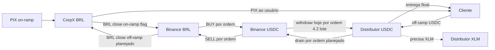

# Treasury Architecture (Capital Proprietário)

## Objetivo

Definir a arquitetura do módulo de **tesouraria** do painel Hi-Li: visibilidade e
gestão do capital próprio que sustenta on/off-ramp (CorpX, Binance, Stellar
`usdc-distributor`), com rebalanceamento manual e, depois, automático — **fora**
do caminho crítico do usuário.

Este documento é o contrato de implementação. A execução segue as fases 4.0–4.6
(4.5 está no código, flag off; 4.6 ainda só no plano).

## Contexto atual (baseline)

| Bolso | Papel | Estado no código |
|-------|--------|------------------|
| CorpX (BRL) | Recebe/envia PIX | `queryBalance` no adapter; sem painel |
| Binance (BRL + USDC) | Trades e saque cripto | Módulo + rotas admin; sem UI de tesouraria |
| Stellar `usdc-distributor` (USDC + XLM) | Float on-chain + gas | Env `ONRAMP_USDC_DISTRIBUTOR_*`; sem Horizon |
| BRH | Posição regulatória | Card no dashboard |

Hoje a **reconciliação on-ramp** é por ordem (`reconciliation.ts`): BUY Binance →
BRH redeem → **withdraw Binance → distributor**. O saque (~1 USDC) é efetivamente
repassado por operação via `ONRAMP_USDC_DELIVERY_FEE_USDC`.

O BUY gasta **BRL já na Binance**. O PIX do cliente entra na **CorpX**. As vias manuais CorpX ↔ Binance BRL já existem. O on-ramp devolve o BRL do BUY
por ordem quando `TREASURY_ONRAMP_BRL_CLOSE_ENABLED=true` (default off): após o
fill, um `treasury_run` `corpx_brl_to_binance` (`trigger=onramp`) paga o QR da
ordem fiat. Sem a flag, CorpX acumula BRL e a Binance drena BRL a cada BUY.

No **off-ramp** o espelho é invertido: o PIX ao usuário sai da **CorpX** na hora
(`pix_sent`); o SELL na Binance vem **depois** e gera BRL na exchange. Sem
Binance → CorpX por ordem, a CorpX drena BRL e a Binance acumula BRL. O USDC do
usuário fica no distributor; o SELL consome **USDC já na Binance** (float).

`BINANCE_MVP_PLAN.md` deixa bandas de float / loop de tesouraria fora do MVP.

## Princípios de desenho

1. Leituras e ações de tesouraria **nunca** no caminho síncrono do usuário.
2. Acesso exclusivo a `platform_admin` (`role = admin`).
3. Falha parcial por bolso: overview degrada com `ok: false` + `error`, sem 500 global.
4. Separar **reconciliação econômica** (BUY + BRH por ordem) de **refill físico**
   (withdraw em lote) — a partir da Fase 4.2.
5. Automação só depois de refill manual validado em produção.
6. Feature flags para rollback (ex.: `TREASURY_BATCH_REFILL_ENABLED`).
7. Recarga de **XLM** no distributor: visibilidade + alerta na v1; top-up manual.

## Hierarquia de domínio

```text
Platform (Hi-Li)
└── Treasury (capital proprietário)
    ├── CorpX BRL
    ├── Binance BRL / USDC
    ├── Stellar distributor USDC / XLM
    ├── BRH (informativo)
    ├── Policies (Fase 4.2+)
    └── Runs / refill batches (Fase 4.1+)
```



## Modelo de dados (fases posteriores)

### `treasury_policies` (4.2+)

Configuração por bolso: `min_balance`, `target_balance`, `max_balance`,
`auto_enabled`, `cooldown_minutes`, `refill_volume_threshold` (distributor USDC).

### `treasury_runs` / `treasury_refill_batches` (4.1+)

Auditoria de execuções: `trigger` (`manual` \| `scheduled` \| `threshold` \| `onramp`),
`status`, `dry_run`, `steps`, `error`, vínculo com withdraw Binance e ordens.

Fase 4.0 **não** cria tabelas — só agrega leituras existentes.

## Autenticação

- UI: `/app/treasury` — redirect se `profile.role !== 'admin'`.
- API: `Authorization: Bearer <access_token>` + `requireAdminFromAccessToken`
  (mesmo padrão de `/api/binance/*`).

## UI mapa

| Rota | Papel | Conteúdo |
|------|--------|----------|
| `/app/treasury` | admin | Aba **Bolsos**: overview + runs manuais. Aba **Configurações**: placeholder das políticas automáticas (ainda não persiste nem dispara). |

Nav: `managementNavItems` em `AppShell` (bloco admin).

## Contratos API

### `GET /api/treasury/overview` (Fase 4.0)

Resposta (resumo):

- `generatedAt`
- `pockets.corpx` — available / reserved / total BRL
- `pockets.binance` — free/locked BRL e USDC
- `pockets.distributor` — endereço (completo server-side), rede, USDC, XLM, Horizon URL
- `pockets.brh` — saldo singleton
- `pendingRefills` — ordens em `usdc_delivered` \| `needs_review` \| `fx_settled` \| `brh_redeemed`

Cada pocket: `{ ok: true, ... } | { ok: false, error: string }`.

## Fases de implementação

### Fase 4.0 — Visibilidade (read-only)

| Entrega | Detalhe |
|---------|---------|
| Doc | Este arquivo |
| Horizon | Client leve (fetch) para saldos XLM + USDC do distributor |
| API | `GET /api/treasury/overview` |
| UI | `/app/treasury` + nav + i18n |

**Critério de aceite:** admin vê 4 cards (CorpX, Binance BRL+USDC, distributor
USDC+XLM, BRH) e a fila de refills; zero movimento de capital.

### Fase 4.1 — Refill manual em lote

| Entrega | Detalhe |
|---------|---------|
| Schema | `treasury_runs` (auditoria) |
| API | `POST/GET /api/treasury/runs` |
| Lógica | Dry-run + withdraw Binance USDC → distributor |
| UI | Formulário na tesouraria + histórico de runs |

**Critério:** gestor recompõe float sem SSH/curl.

### Fase 4.2 — Desacoplar withdraw da reconciliação por ordem

`startOnrampReconciliation` encerra em `brh_redeemed` quando
`TREASURY_BATCH_REFILL_ENABLED=true`; lotes cobrem o refill físico.

**Critério:** 1 saque Binance por lote; rollback via flag.

### Fase 4.3 — Políticas + automação

CRUD de políticas; cron; alertas (CorpX baixo, float USDC, XLM baixo, lote falhou).

A aba **Configurações** em `/app/treasury` já esboça o formulário (trilhos,
bandas, lote vs per-ordem, shadow mode). Ainda é placeholder: não persiste e
não dispara runs.

### Fase 4.4 — Precificação + hardening

Revisar taxa de 1 USDC na quote; `clientOrderId`; retries; alertas externos.

### Fase 4.5 — Fechamento BRL por ordem (on-ramp)

Código em `src/lib/treasury/onramp-brl-close.ts`, disparado em paralelo após o
BUY em `startOnrampReconciliation`. Flag `TREASURY_ONRAMP_BRL_CLOSE_ENABLED`
(default off). Valor = `binance_cummulative_quote_qty`. Idempotência: 1 run
não-dry por ordem (`source_onramp_order_id`). Não altera `complete` da ordem.

Ver [Fechamento BRL por ordem](#fechamento-brl-por-ordem-on-ramp-planejado).

### Fase 4.6 — Fechamento por ordem (off-ramp) — **planejado**

Não implementar até o desenho abaixo estar acordado. Objetivo: cada off-ramp que
já fez SELL recompõe os dois bolsos gastos no float: USDC distributor → Binance
(`distributor_usdc_to_binance`) e BRL Binance → CorpX (`binance_brl_to_corpx`).
Fora do caminho do usuário.

Ver [Fechamento por ordem (off-ramp)](#fechamento-por-ordem-off-ramp-planejado).

## Fechamento BRL por ordem (on-ramp) — planejado

### O que já acontece hoje

Caminho do cliente e reconciliação econômica (`src/lib/onramp/`):

1. Operador pede quote (`quoted`).
2. Lock da quote → API emite PIX CorpX (`awaiting_pix`).
3. CorpX confirma PIX (`pix_received`).
4. Registro BRH (venda) e entrega USDC do **float** do distributor (`brh_sold` → `usdc_delivered`). O cliente já está atendido.
5. Async (`startOnrampReconciliation`): BUY Binance com `quoteOrderQty = amount_brl` (`fx_settled`).
6. Registro local de redenção BRH (`brh_redeemed`).
7. Withdraw USDC Binance → distributor (`complete`). Hoje `complete` **encerra** a reconciliação; se o status já é `complete`, o job retorna sem passos extras.

O BUY não “reembolsa o distributor em USDC” na hora do trade: ele **gasta BRL da Binance** para comprar USDC na exchange. O withdraw (passo 7) é que devolve USDC on-chain. BRH é trilho regulatório, não movimento de caixa BRL.

### O buraco de caixa

| Depois do PIX + BUY | CorpX BRL | Binance BRL | Distributor USDC |
|---------------------|-----------|-------------|------------------|
| PIX cliente         | +amount_brl | — | — |
| Entrega ao cliente  | — | — | −USDC entregue |
| BUY                 | — | −BRL gasto no fill | — |
| Withdraw USDC       | — | −USDC sacado | +USDC do fill (− taxa rede) |

Falta o espelho do BUY: **CorpX −BRL / Binance +BRL**.

### Complemento proposto

8. Depois do BUY preenchido (`fx_settled`), criar depósito fiat BRL Pix na Binance no valor do BRL **efetivamente gasto**.
9. CorpX paga o **QR/copia-e-cola (EMV)** dessa ordem — o mesmo trilho manual que já funciona.

Isso fecha o ciclo **BRL da operação**. Não substitui bandas de float (Fase 4.3): taxas, PIX in-flight, mínimo fiat e falhas geram drift; o automático por bolso continua a rede de segurança.

Off-ramp (SELL + drain USDC + Binance → CorpX) é a Fase 4.6.

### Como encaixar (recomendação)

- **Não** colocar os passos 8–9 no caminho síncrono do cliente.
- **Não** bloquear a entrega USDC nem o withdraw do distributor se o PIX CorpX→Binance falhar.
- **Não** pendurar o BRL depois de `complete` sem mudar o early-return de `startOnrampReconciliation`.
- Disparar o fechamento BRL **em paralelo após `fx_settled`**, como `treasury_run` (`corpx_brl_to_binance`, `trigger` ligado à ordem), com idempotência **1 run / 1 depósito fiat / 1 PIX por on-ramp**.
- `complete` da ordem continua significando “BUY + BRH + withdraw USDC pedidos”. O BRL é tesouraria vinculada, visível em `/app/treasury` e no detalhe da ordem (ids), sem novo status obrigatório no contrato do operador nesta fase.
- Flag `TREASURY_ONRAMP_BRL_CLOSE_ENABLED` (default off) até o smoke por ordem em produção.

### Estado da implementação (4.5)

Entregue no código; permanece desligado até `TREASURY_ONRAMP_BRL_CLOSE_ENABLED=true`
em produção. Smoke: um on-ramp pequeno, conferir `treasury_runs` com
`trigger=onramp`, `paid_via=qr_async`, e crédito da ordem fiat Binance. Não
reenviar se o PIX estiver in-flight.

### Cuidados obrigatórios

1. **Gatilho = BUY filled**, não PIX recebido. Sem `binance_order_id` / fill, não criar depósito fiat (senão pré-fundeia a Binance sem ter gastado).
2. **Valor = BRL gasto no fill** (`binance_cummulative_quote_qty`), não o USDC entregue ao cliente e não um “máximo disponível”. Se `cummulativeQuoteQty` divergir de `amount_brl`, pagar o gasto real; o residual vai para drift/4.3.
3. **Pagar só o EMV** daquela ordem fiat. Chave PIX decodificada não identifica a cobrança (já visto no manual).
4. **Idempotência:** persistir `orderId` do depósito fiat (e o `treasury_run`) na ordem on-ramp. Replay não cria segundo QR nem segundo PIX. Idempotency key CorpX estável (`treasury-brl-{runId}` ou derivado do on-ramp id).
5. **Não retriar PIX in-flight.** Se o dinheiro saiu da CorpX, só reconciliar o crédito Binance / `needs_review`. Mesmas regras do manual (`assertCorpXPixOutAccepted`, BACEN E2E).
6. **Lock entre automático e manual.** Um on-ramp in-flight e um envio manual CorpX→Binance não podem dobrar o mesmo BRL. Lock por ordem + teto diário/run.
7. **Mínimo fiat Binance / notional.** Quote já exige min notional do par; depósito Pix pode ter piso próprio. Abaixo do piso: não forçar; acumular (lote) ou `needs_review` de tesouraria — decisão aberta.
8. **Taxas.** PIX out CorpX e crédito Binance podem não bater 1:1. Não “completar” tesouraria só com submit; exigir crédito da ordem fiat ou classificar in-flight como hoje.
9. **`complete` da ordem ≠ BRL creditado.** Falha BRL não deve marcar a ordem do cliente como `failed`. Fila de tesouraria + alerta (CorpX alto / Binance BRL baixo).
10. **Ordem vs lote USDC (4.2).** Fechamento BRL é independente do withdraw USDC em lote. BUY continua por ordem; BRL close acompanha o BUY. Withdraw físico USDC pode continuar por ordem agora e lote depois.
11. **Mensagem PIX ASCII** (`Treasury BRL-Binance …`); sanitizar unicode (BACEN).
12. **Circuit breaker.** CorpX insuficiente, Binance fiat down, ou N falhas seguidas: parar o automático, não o on-ramp do cliente.

### Sequência alvo (caixa)

```text
PIX in (CorpX)
  → float USDC ao cliente
  → BUY (Binance BRL → Binance USDC)     [já existe, por ordem]
  → withdraw USDC → distributor          [já existe; 4.2 pode atrasar/lote]
  → depósito fiat BRL + PIX EMV CorpX    [novo, após fill, paralelo]
```

## Fechamento por ordem (off-ramp) — planejado

### O que o usuário vê (coberto)

1. Pede quote (`quoted`).
2. Lock → Ramp devolve wallet + memo único (`awaiting_deposit`).
3. Envia USDC.
4. Ramp confirma recebimento (`usdc_received`).
5. Recebe o PIX na chave informada (`pix_sent`). Para o usuário, o off-ramp acabou.

BRH, o SELL e os dois closes de tesouraria são async e fora da UX. `complete` hoje significa “PIX enviado + BRH + SELL pedidos”, não “bolsos recompostos”.

### O que acontece de fato (`src/lib/offramp/reconciliation.ts`)

A ordem **não** é “SELL e depois PIX”. O PIX sai **antes** do trade, do float da CorpX:

1. Quote / lock / depósito USDC (Ramp: endereço + memo).
2. `usdc_received` — USDC no distributor/omnibus, não na Binance.
3. `pix_sent` — CorpX `initiatePIXCashOut` de `amount_brl` para a chave do usuário.
4. BRH issue + redemption até `brh_recorded` (trilho regulatório).
5. SELL Binance com `quoteOrderQty = amount_brl` (`fx_settled`) — vende USDC **já na Binance** para obter ~esse BRL.
6. `complete`. `retryOfframpReconciliation` encerra aqui; não há drain USDC nem fiat withdraw.

### O buraco de caixa

| Depois do USDC in + PIX + SELL | CorpX BRL | Binance BRL | Binance USDC | Distributor USDC |
|--------------------------------|-----------|-------------|--------------|------------------|
| Depósito do usuário            | — | — | — | +USDC recebido |
| PIX ao usuário                 | −amount_brl | — | — | — |
| SELL                           | — | +BRL do fill | −USDC vendido | — |

Falta o espelho do SELL nos dois bolsos de float:

- **USDC:** distributor −USDC / Binance +USDC (o que a exchange vendeu).
- **BRL:** Binance −BRL / CorpX +BRL (o que a CorpX já pagou no PIX).

O SELL continua usando float de USDC na Binance. Não dá para vender “o mesmo” USDC do usuário na hora: o crédito on-chain na Binance atrasa minutos. O drain por ordem **recompõe** esse float; não substitui o piso de USDC na exchange.

### Complemento proposto

7. Depois do SELL preenchido (`fx_settled`), enviar o USDC **efetivamente vendido** (`binance_executed_qty`) do distributor para a Binance (`kind: distributor_usdc_to_binance` — Ramp `POST /onramp` USDC `category=treasury`, memo = tag Binance / MEMO_TEXT).
8. No mesmo gatilho, sacar o BRL **efetivamente obtido** (`binance_cummulative_quote_qty`) Binance → CorpX (`kind: binance_brl_to_corpx`, `bank_transfer` na conta vinculada — não é PIX QR).

Dois `treasury_run` independentes, 1 de cada kind por off-ramp. Falha de um não retrai o outro nem o PIX ao usuário. Bandas (4.3) cobrem taxa de rede (~1 USDC), atraso de crédito Binance e drift. O 4.5 é o BRL no sentido contrário; o withdraw USDC do on-ramp já é o espelho do passo 7.

### Como encaixar (recomendação)

- **Não** atrasar o PIX ao usuário esperando SELL, drain USDC ou withdraw fiat.
- **Não** esperar o USDC creditar na Binance para fazer o SELL (o crédito do drain atrasa; o SELL segue no float).
- **Não** sacar BRL da Binance antes do fill (não há BRL “resultado do trade” ainda).
- **Não** drenar USDC antes do fill neste recorte: o valor certo é o `executedQty` do SELL. Drain em `usdc_received` com `amount_usdc` fica como alternativa (mais drift vs fill).
- **Não** pendurar os passos depois de `complete` sem mudar o early-return de `retryOfframpReconciliation`.
- Disparar **em paralelo após `fx_settled`**: `distributor_usdc_to_binance` + `binance_brl_to_corpx`, cada um com vínculo à ordem e idempotência 1 run por kind.
- `complete` da ordem continua “PIX + BRH + SELL”. Falha de tesouraria não marca a ordem como `failed`.
- Flags independentes (default off): `TREASURY_OFFRAMP_USDC_CLOSE_ENABLED` e `TREASURY_OFFRAMP_BRL_CLOSE_ENABLED`, para smoke de um trilho sem o outro.

### Cuidados obrigatórios

1. **Gatilho = SELL filled**, não `usdc_received` nem `pix_sent`. Sem `binance_order_id` / fill, não criar drain nem fiat withdraw.
2. **Valor USDC = `binance_executed_qty`** (USDC vendido). **Valor BRL = `binance_cummulative_quote_qty`**. Não usar “saldo disponível” do bolso. Se o fill divergir do quote, o residual vai para drift/4.3.
3. **Trilhos certos:** USDC = Ramp tesouraria + MEMO_TEXT da tag Binance (já fumado no manual). BRL = `bank_transfer` na conta bound (`BINANCE_BRL_WITHDRAW_ACCOUNT_*`). Não misturar com QR/EMV.
4. **Idempotência:** persistir ids (Ramp onramp tesouraria / fiat withdraw) e os dois `treasury_run` na ordem off-ramp. Replay não cria segundo drain nem segundo saque.
5. **Não retriar** drain ou fiat in-flight. Poll de crédito Binance USDC e de settlement fiat como no manual.
6. **Lock automático vs manual** nos dois kinds (`distributor_usdc_to_binance` e `binance_brl_to_corpx`).
7. **Mínimos:** saque Stellar/Binance USDC (~1 USDC de rede) e piso fiat BRL. Abaixo do piso: lote ou `needs_review` de tesouraria.
8. **Crédito USDC na Binance atrasa minutos.** O SELL desta ordem já ocorreu; o drain recompõe a *próxima*. Manter piso de USDC na Binance senão o FX quebra mesmo com o drain enfileirado.
9. **Liquidação BRL bancária é lenta.** Run pode completar com settlement pending. Alertar se CorpX não creditar.
10. **`complete` da ordem ≠ tesouraria fechada.** Fila de tesouraria + alerta (CorpX baixo, Binance BRL alto, Binance USDC baixo, distributor USDC alto).
11. **Conta CorpX bound** e tag de depósito USDC Binance têm que continuar as do smoke manual.
12. **Circuit breaker.** Ramp/Horizon/Binance fiat down, ou N falhas: parar o automático daquele trilho, não o PIX ao usuário.

### Sequência alvo (caixa)

```text
USDC in (distributor)
  → PIX out (CorpX float → usuário)              [já existe; UX]
  → BRH issue/redeem                             [já existe; regulatório]
  → SELL (Binance USDC → Binance BRL)            [já existe, por ordem]
  → drain USDC distributor → Binance             [novo, após fill, paralelo]
  → fiat withdraw BRL → CorpX                    [novo, após fill, paralelo]
```

## Decisões abertas

1. Threshold de volume do primeiro lote (ex.: 5k / 10k / 25k USDC).
2. Piso operacional de USDC e XLM no distributor.
3. Extrato CorpX no painel (além do saldo) — sim/não na 4.1+.
4. BUY Binance continua por ordem (recomendado: sim).
5. Taxa na quote: manter 1 USDC até haver dados de lote (modelo C).
6. **Fiat Binance BRL/PIX:** adapter + rotas admin de smoke prontos
   (`binance.fiat`, `/api/binance/fiat/*`). UI de envio CorpX→Binance no card
   CorpX (`kind: corpx_brl_to_binance`). Recusas do BACEN (30/07–21/08)
   foram o `→` no campo livre do PIX (`Treasury BRL→Binance …`); a mensagem
   agora é ASCII (`Treasury BRL-Binance …`) e o adapter sanitiza qualquer
   `description`/`message` PIX. O pagamento CorpX usa o QR/copia-e-cola
   (`ext.qrCode` EMV) via `/pix/out/qr-code/async` — não a chave PIX
   decodificada, que não identifica a cobrança Binance. Sem EMV após o poll,
   a run falha (sem fallback de chave estática). Binance→CorpX
   (`binance_brl_to_corpx`) está operacional.
7. **USDC distributor → Binance:** kind `distributor_usdc_to_binance`. Destino
   via `GET /sapi/v1/capital/deposit/address` (fallback
   `BINANCE_USDC_DEPOSIT_ADDRESS` + `TAG`). Pagamento: Ramp
   `POST /onramp` USDC `category=treasury`, memo = tag Binance (MEMO_TEXT).
   Smoke de 1 USDC deve confirmar que a Binance credita MEMO_TEXT.
8. **Fechamento BRL on-ramp (4.5):** valor = `cummulativeQuoteQty` vs `amount_brl`;
   piso do depósito fiat Binance (lote vs `needs_review`); `complete` da ordem
   espera BRL? (recomendado: não).
9. **Fechamento off-ramp (4.6):** USDC drain = `executedQty` vs `usdc_received_amount`
   (recomendado: fill); BRL = `cummulativeQuoteQty`; mínimos de rede/fiat;
   `complete` espera tesouraria? (recomendado: não); flags USDC e BRL
   independentes para smoke.

## Riscos

| Risco | Mitigação |
|-------|-----------|
| Horizon / CorpX / Binance indisponível | Pocket `ok: false`; UI mostra erro local |
| Issuer USDC errado | `STELLAR_USDC_ISSUER` + defaults por rede |
| Mudança 4.2 em produção | Feature flag + dry-run + validação manual 4.1 |
| XLM zerado | Alerta na overview; top-up manual |
| Memo Binance ≠ MEMO_TEXT | Smoke 1 USDC; se não creditar, avaliar MEMO_ID na Ramp API |
| PIX CorpX→Binance duplicado ou sem match | Idempotência por ordem; pagar só EMV; não retriar in-flight |
| BUY ok e BRL close falha | Ordem do cliente permanece complete; run de tesouraria em failed/review |
| SELL ok e close off-ramp falha | Ordem complete; runs USDC e/ou BRL em failed/review; float Binance USDC e CorpX BRL drenam até retry |

## Relação com roadmap

- Sucede o recorte Binance MVP (`BINANCE_MVP_PLAN.md` — tesouraria pós-MVP).
- Paralelo a Clients 3.x; não bloqueia KYB/KYC.
- Reusa `RAMP_CATEGORY_TREASURY` no drain USDC (`distributor_usdc_to_binance`).

## Referências

- `BINANCE_MVP_PLAN.md`
- `src/lib/onramp/reconciliation.ts`
- `src/lib/treasury/onramp-brl-close.ts`
- `src/lib/onramp/treasury-deposit.ts`
- `src/lib/corpx/adapter/corp-x-adapter.ts`
- `src/lib/server/binance/`

## Checklist Fase 4.0

- [x] `TREASURY_ARCHITECTURE.md`
- [x] Horizon balances (XLM + USDC)
- [x] `GET /api/treasury/overview`
- [x] Página `/app/treasury` + nav + i18n
- [x] `.env.example` (Horizon / issuer)

## Checklist Fase 4.1

- [x] Migration `treasury_runs`
- [x] Dry-run + execute Binance USDC refill
- [x] `POST/GET /api/treasury/runs`
- [x] UI refill + histórico na tesouraria
- [x] Testes de resolução de valor
- [x] Kind `distributor_usdc_to_binance` (Ramp USDC category=treasury)

## Checklist Fase 4.5

- [x] Flag `TREASURY_ONRAMP_BRL_CLOSE_ENABLED` (default off)
- [x] Valor = `binance_cummulative_quote_qty`
- [x] `treasury_run` `corpx_brl_to_binance` `trigger=onramp` após BUY
- [x] Idempotência 1 run por on-ramp (`source_onramp_order_id`)
- [x] Pagar EMV; não bloquear `complete` / withdraw USDC
- [ ] Smoke produção com flag on
